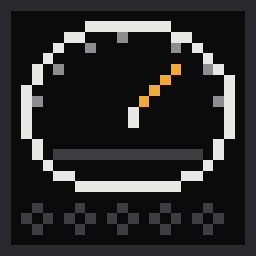
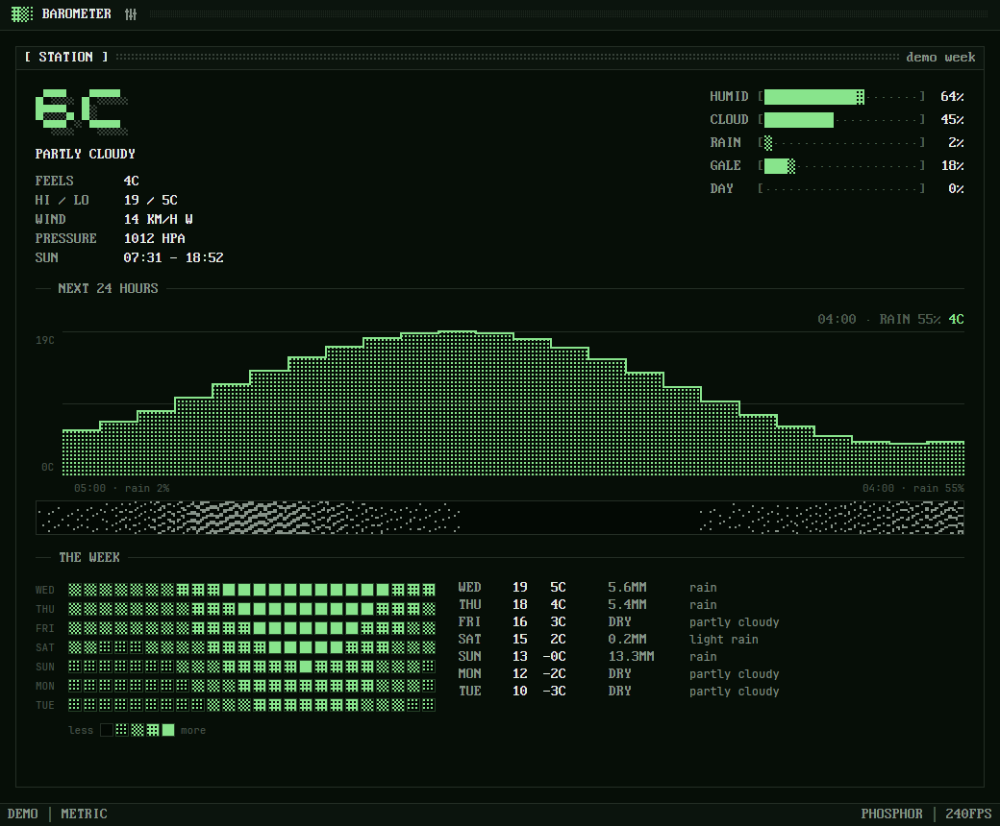

<p align="center">
  
</p>

<h1 align="center">Barometer</h1>

<p align="center">
  A <a href="https://github.com/rwetz/ferrite-design">Ferrite</a> weather station in one panel:
  ASCII gauges, the next 24 hours, rain in dither, the week as a heatmap.
</p>

<p align="center">
  <a href="https://github.com/rwetz/ferrite-barometer/actions/workflows/ci.yml"></a>
  <a href="https://github.com/rwetz/ferrite-barometer/releases/latest"></a>
  <a href="LICENSE"></a>
</p>



Barometer is a weather station you leave open. Today's reading sits in big
block digits beside a stack of ASCII gauges, the next 24 hours run as a line
chart with the rain drawn under it as a dither texture, and the whole week is
a heatmap of temperature by hour. It starts in the Phosphor scheme, green on
black, because weather instruments should.

The weather comes from [Open-Meteo](https://open-meteo.com), which is free and
needs no key and no account: type a town and you're done.

It's a native desktop app built with [GPUI](https://gpui.rs) and
[ferrite-design](https://github.com/rwetz/ferrite-design): amber on iron,
0px corners, pixel type and stepped motion. It runs no webview.

## Features

- **The reading.** Temperature in block digits, the conditions, feels-like,
  the day's high and low, wind speed and compass direction, sea-level
  pressure, and sunrise and sunset.
- **Gauges.** Humidity, cloud cover, the chance of rain this hour, wind
  against a gale, and how far through the daylight you are, as ASCII gauges.
- **The next 24 hours.** A line chart of the temperature (hover a column for
  the hour and its chance of rain), and under it the rain as slanted dither
  streaks: dense where it's likely and heavy, blank where it's dry.
- **The week.** A 7×24 heatmap of temperature, warm hours dense, cold hours
  sparse, beside a line per day with the high, low, rainfall and conditions.
- **Ferrite throughout.** Ten color schemes, a command palette
  (<kbd>Ctrl</kbd>+<kbd>Shift</kbd>+<kbd>P</kbd>), a Settings drawer
  (<kbd>Ctrl</kbd>+<kbd>,</kbd>), and a CRT switch-off when you close the
  window.

## Install

### Download

Prebuilt binaries for Windows, macOS and Linux are attached to each
[release](https://github.com/rwetz/ferrite-barometer/releases/latest).
Unpack the archive and run `ferrite-barometer`. Nothing else is needed.

### From source

```bash
git clone https://github.com/rwetz/ferrite-barometer
cd ferrite-barometer
cargo run --release
```

On Linux you need the usual GPUI development packages first:

```bash
sudo apt install libxkbcommon-dev libxkbcommon-x11-dev libwayland-dev libxcb1-dev libfontconfig-dev
```

On macOS with Xcode 27 or later, install the Metal toolchain once:

```bash
xcodebuild -downloadComponent MetalToolchain
```

## Setting a place

On first launch Settings opens by itself on the **Location** field. Type a
town (`Fargo`, `Lisbon`) or coordinates (`46.88,-96.79`) and press
<kbd>Enter</kbd>. Barometer looks the town up with Open-Meteo's geocoder and
refreshes every 15 minutes (<kbd>Ctrl</kbd>+<kbd>R</kbd> refreshes now).

Until a place is set it shows a made-up demo week, labelled **DEMO** in the
status bar, so the window is never empty.

## Configuration

Settings are saved as plain `key = value` lines:

| OS | Settings |
|---|---|
| Windows | `%APPDATA%\ferrite\barometer.conf` |
| macOS | `~/Library/Application Support/ferrite/barometer.conf` |
| Linux | `$XDG_CONFIG_HOME/ferrite/barometer.conf` (or `~/.config/…`) |

```ini
scheme = phosphor     # ferrite mono graphite slate concrete harbor cyanotype phosphor verdigris bruise
appearance = dark     # dark | light | system
fps = 240             # 12–240; 25 is the classic stepped look
location = Fargo      # a town, or "lat,lon"
units = metric        # metric | imperial
```

| Variable / flag | Effect |
|---|---|
| `BAROMETER_LOCATION` | Used when no location is set in Settings. |
| `--demo` | Shows the demo week and doesn't touch the network. |
| `--settings` | Starts with Settings open. |
| `FERRITE_*` | The shared look from [Lodestone](https://github.com/rwetz/ferrite-lodestone); provides defaults until the app saves its own preferences. |

## With Lodestone

[Lodestone](https://github.com/rwetz/ferrite-lodestone) launches Ferrite apps
from their **source checkouts**: it scans a folder for crates that depend on
ferrite-design, runs `cargo build`, and starts the result with its shared
look. To see Barometer there, clone this repo next to Lodestone (or into the
folder you point Lodestone at) and have a Rust toolchain on your `PATH`:

```
Dev/
├── ferrite-lodestone/
└── ferrite-barometer/ # appears as a tile in Lodestone
```

A downloaded Barometer binary runs fine on its own, but Lodestone doesn't
discover installed binaries.

## Development

```bash
cargo test                    # forecast parsing, the rain texture, the week grid, settings
cargo clippy --all-targets
cargo run -- --demo           # no network needed
```

- `src/forecast.rs`: Open-Meteo requests and parsing, the demo week, and the
  derived numbers (now, next 24 hours, the week grid, daylight). Pure apart
  from `fetch` and `resolve`, and unit-tested against sample responses.
- `src/rain.rs`: the rain texture, one dither band per hour.
- `src/settings.rs`: the settings file.
- `src/main.rs`: the view. It follows ferrite-design's
  [AGENTS.md](https://github.com/rwetz/ferrite-design/blob/main/AGENTS.md).

On Windows, `build.rs` embeds `assets/logo.ico` as the executable and window
icon. The `.ico` is generated from `assets/logo.svg`, so regenerate it when
the logo changes.

## License

Apache-2.0, see [LICENSE](LICENSE). The binary embeds fonts from
ferrite-design under their own licenses; see [NOTICE](NOTICE).
